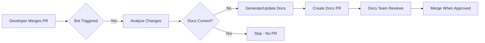

# Documentation Bot Demo

An AI-powered documentation bot that automatically generates comprehensive markdown documentation for Go applications using Claude Code.

## 🎯 What This Does

When a PR is merged to `main`, this bot:

1. ✅ Analyzes the merged PR changes
2. ✅ Examines all related Go modules (not just changed files)
3. ✅ Checks if documentation exists and is up-to-date
4. ✅ If needed: Generates/updates comprehensive markdown docs
5. ✅ Creates a new PR with the documentation changes
6. ✅ Assigns it to the docs team for review

**If documentation is already current → No PR is created** ✨

## 📊 Workflow



## 🏗️ Project Structure

```
doc-agent-demo/
├── cmd/
│   └── api/              # Demo Go API
│       └── main.go
├── internal/
│   ├── handlers/         # HTTP handlers
│   │   ├── health.go
│   │   ├── user.go
│   │   └── product.go
│   └── models/           # Data models
│       ├── user.go
│       └── product.go
├── docs/                 # Generated documentation (by bot)
│   ├── API.md
│   ├── ARCHITECTURE.md
│   └── DATA_MODELS.md
├── .github/
│   └── workflows/
│       └── docs-bot.yml  # Bot workflow
├── DESIGN.md             # Complete design doc
├── README.md             # This file
└── go.mod
```

## 🚀 Quick Start

### Prerequisites

- Go 1.23+
- GitHub repository
- Anthropic API key (for Claude)

### Setup

1. **Clone the repository:**

   ```bash
   git clone <your-repo>
   cd doc-agent-demo
   ```

2. **Add GitHub Secret:**

   ```bash
   gh secret set ANTHROPIC_API_KEY
   # Paste your Anthropic API key when prompted
   ```

3. **Run the demo API locally:**

   ```bash
   go mod download
   go run cmd/api/main.go
   ```

   The API will start on `http://localhost:8080`

4. **Test the endpoints:**

   ```bash
   # Health check
   curl http://localhost:8080/api/v1/health

   # Get users
   curl http://localhost:8080/api/v1/users

   # Create user
   curl -X POST http://localhost:8080/api/v1/users \
     -H "Content-Type: application/json" \
     -d '{"name":"John Doe","email":"john@example.com"}'
   ```

### Trigger the Documentation Bot

The bot automatically runs when a PR is merged to `main`. To test it:

1. Make changes to the Go code
2. Create a PR
3. Merge the PR to `main`
4. Watch GitHub Actions run the documentation bot
5. Review the generated documentation PR

## 📝 API Endpoints

| Method | Endpoint | Description |
|--------|----------|-------------|
| `GET` | `/api/v1/health` | Health check |
| `GET` | `/api/v1/users` | List all users |
| `GET` | `/api/v1/users/:id` | Get user by ID |
| `POST` | `/api/v1/users` | Create new user |
| `PUT` | `/api/v1/users/:id` | Update user |
| `DELETE` | `/api/v1/users/:id` | Delete user |
| `GET` | `/api/v1/products` | List all products |
| `GET` | `/api/v1/products/:id` | Get product by ID |
| `POST` | `/api/v1/products` | Create new product |

## 🤖 How the Bot Works

### 1. Trigger

Workflow file: `.github/workflows/docs-bot.yml`

Triggers on:
```yaml
on:
  pull_request:
    types: [closed]
    branches: [main]
```

Only runs if PR was actually merged:
```yaml
if: github.event.pull_request.merged == true
```

### 2. Analysis

Uses **Claude Code GitHub Action** (official):

```yaml
- uses: anthropics/claude-code-action@v1
  with:
    anthropic_api_key: ${{ secrets.ANTHROPIC_API_KEY }}
    prompt: |
      Analyze the merged PR changes and related Go modules.
      Check if documentation needs to be created or updated.
      Generate verbose, comprehensive markdown documentation.
```

### 3. Documentation Generation

Claude Code:
- Reads all changed files from the merged PR
- Analyzes ALL related modules (not just changed files)
- Checks existing documentation in `docs/` folder
- Decides if updates are needed
- Generates comprehensive markdown files

### 4. PR Creation

If documentation changes are made:

```yaml
- uses: peter-evans/create-pull-request@v6
  with:
    title: "📚 docs: Update for PR #123"
    labels: documentation, needs-review, auto-generated
    team-reviewers: docs-team
```

## 📚 Generated Documentation Examples

The bot generates verbose, comprehensive documentation:

### docs/API.md

- Complete API reference for all endpoints
- Request/response schemas with tables
- Code examples in multiple languages (cURL, Go, Python, JavaScript)
- Error responses documented
- Authentication requirements
- Rate limiting info

### docs/ARCHITECTURE.md

- System architecture diagrams (Mermaid)
- Component descriptions
- Data flow explanations
- Technology stack justifications
- Design decisions documented

### docs/DATA_MODELS.md

- All Go struct definitions
- Field descriptions with types
- Validation rules
- Database schema if applicable

### README.md Updates

- Keeps README fresh with latest features
- Updates setup instructions
- Adds new API endpoints to table

## 🔧 Configuration

### Customizing the Bot

Edit `.github/workflows/docs-bot.yml` to customize:

- Which files trigger the bot
- What documentation to generate
- Validation rules
- PR settings

### Setting Up Reviewers

**For Organization Repos:**

Uncomment the `team-reviewers` line and set your team:

```yaml
team-reviewers: |
  docs-team
```

**For Personal Repos:**

Use `reviewers` instead and specify individual usernames:

```yaml
reviewers: |
  your-username
  collaborator-username
```

**Note:** `team-reviewers` only works in organization repositories with visible teams. For personal repos, it will cause an error.

### Documentation Style

The bot generates:
- **Verbose** - Comprehensive, not minimal
- **Examples** - Complete, runnable code examples
- **Tables** - Structured data (fields, params, responses)
- **Diagrams** - Mermaid diagrams for architecture
- **Cross-references** - Links to related documentation

## 🎓 Design Document

See [DESIGN.md](./DESIGN.md) for:
- Complete architecture diagrams
- Workflow details
- Prompt engineering examples
- Cost optimization strategies
- Extension plans for other languages

## 🔮 Future Enhancements

- [ ] Support for React/TypeScript frontends
- [ ] Support for Python backends (FastAPI/Django)
- [ ] Support for Infrastructure-as-Code (Terraform)
- [ ] Cost tracking dashboard
- [ ] Feedback loop (thumbs up/down on generated docs)
- [ ] A/B testing for prompt optimization

## 📖 Resources

- **Claude Code GitHub Action**: https://docs.claude.com/en/docs/claude-code/github-actions
- **Claude API Docs**: https://docs.anthropic.com/
- **peter-evans/create-pull-request**: https://github.com/peter-evans/create-pull-request

## 📄 License

MIT

## 🤝 Contributing

1. Fork the repository
2. Create a feature branch
3. Make your changes
4. Create a PR
5. Wait for the documentation bot to run!

---

**Built with ❤️ using Claude Code**
