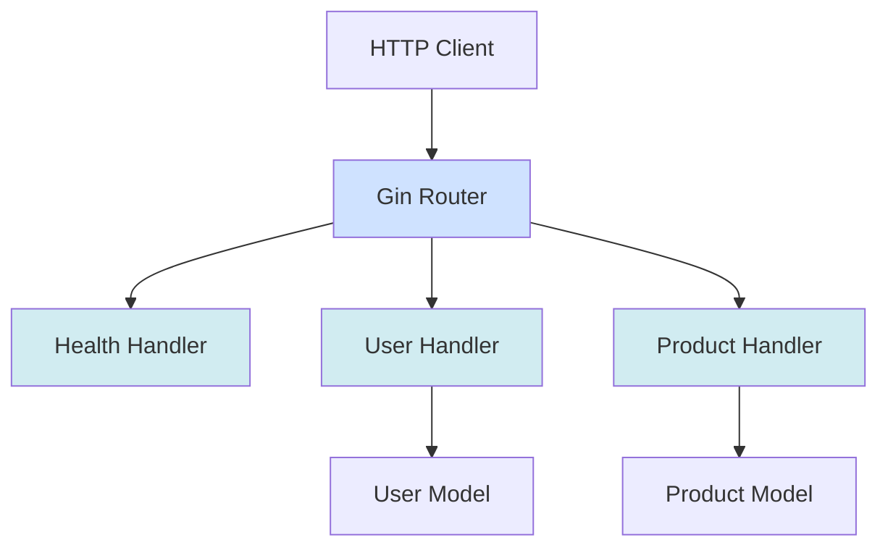
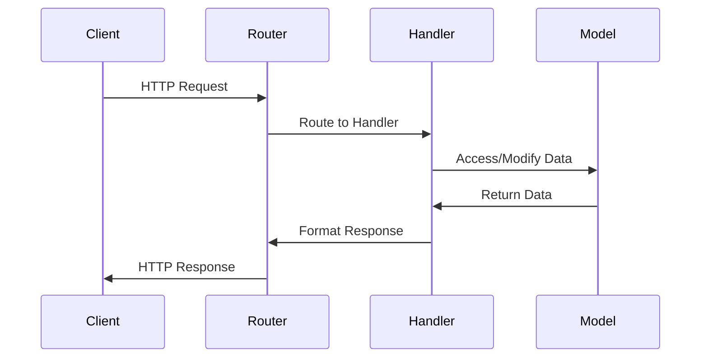
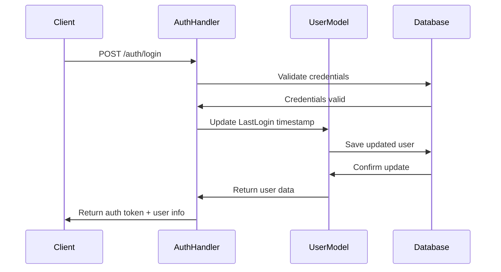

# Architecture Documentation

> **Last Updated:** 2025-11-06
>
> This document describes the system architecture of the doc-agent-demo Go API.

## Overview

The application follows a standard Go API structure with handlers, models, and a main entry point.

## System Architecture



## Project Structure

```
doc-agent-demo/
├── cmd/
│   └── api/
│       └── main.go          # Application entry point
├── internal/
│   ├── handlers/            # HTTP request handlers
│   │   ├── health.go        # Health check endpoint
│   │   ├── user.go          # User CRUD operations
│   │   └── product.go       # Product CRUD operations
│   └── models/              # Data models
│       └── user.go          # User struct definition
├── docs/                    # API documentation (auto-generated)
├── go.mod                   # Go module definition
└── go.sum                   # Go dependencies
```

## Components

### Main Application (`cmd/api/main.go`)

The entry point of the application:
- Initializes the Gin router
- Registers all API routes
- Starts the HTTP server on port 8080

### Handlers (`internal/handlers/`)

HTTP request handlers that implement the API endpoints:

- **health.go**: Health check endpoint
- **user.go**: User management (CRUD operations)
- **product.go**: Product management (CRUD operations)

### Models (`internal/models/`)

Data structures used throughout the application:

- **User**: Represents a user entity with authentication and profile information
  - Core fields: ID, name, email, role
  - Profile fields: phone number, avatar
  - Session tracking: `LastLogin` field for monitoring user engagement
  - Timestamps: created_at, updated_at for audit trails
- **Product**: Represents a product entity for inventory management
  - Core fields: ID, name, description, price, stock
  - Timestamps: created_at, updated_at

## Request Flow



1. Client sends HTTP request
2. Gin router matches the route
3. Appropriate handler processes the request
4. Handler interacts with models if needed
5. Response is formatted and returned

## Technology Stack

- **Web Framework**: Gin (github.com/gin-gonic/gin)
- **Language**: Go 1.23+
- **HTTP Server**: Built-in Go net/http
- **Router**: Gin router with middleware support

## API Versioning

The API uses path-based versioning:
- Current version: `/api/v1/`
- Future versions can be added as `/api/v2/`, etc.

## Features

### User Session Tracking

The application includes user session tracking capabilities through the `LastLogin` field in the User model. This feature provides:

**Architecture Overview:**


**Key Components:**

1. **Data Storage**: The `LastLogin` field is stored as a nullable `*time.Time` in the User model
2. **Automatic Updates**: Authentication handlers automatically update the timestamp on successful login
3. **API Integration**: All user endpoints return the `last_login` field in responses
4. **Analytics Support**: The field enables tracking of:
   - User engagement patterns
   - Inactive user identification
   - Session audit trails
   - User retention metrics

**Implementation Details:**

- **Nullable Design**: Uses pointer type (`*time.Time`) to distinguish between "never logged in" (null) and actual timestamps
- **Thread Safety**: Updates are protected by the same mutex that guards other user data modifications
- **Timestamp Format**: ISO 8601 format in JSON responses (e.g., `"2025-11-06T14:30:00Z"`)
- **Read-Only via API**: The field is managed by authentication logic and not directly modifiable through CRUD endpoints

**Use Cases:**

- **Security Monitoring**: Track unusual login patterns or account access
- **User Engagement**: Identify active vs. inactive users for targeted campaigns
- **Compliance**: Maintain audit logs of user access for regulatory requirements
- **Product Analytics**: Analyze user behavior and platform usage patterns

---

> **Note:** This documentation is maintained by the automated documentation bot.
> When architectural changes are made, the bot updates this file to reflect the new structure.
