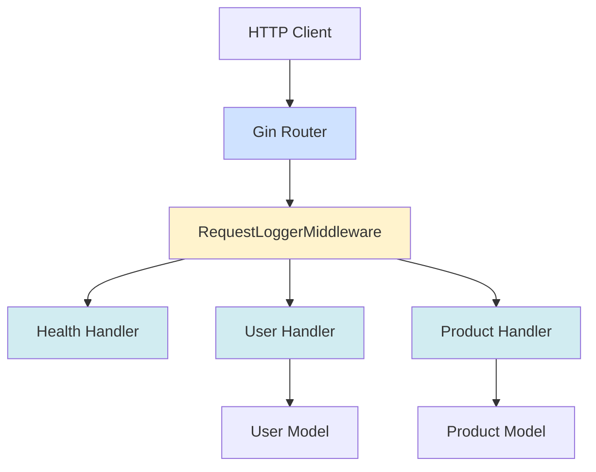
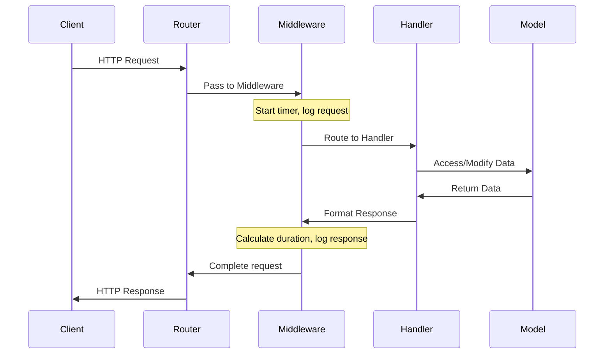

# Architecture Documentation

> **Last Updated:** 2025-11-06
>
> This document describes the system architecture of the doc-agent-demo Go API.

## Overview

The application follows a standard Go API structure with handlers, models, and a main entry point.

## System Architecture



## Project Structure

```
doc-agent-demo/
├── cmd/
│   └── api/
│       └── main.go          # Application entry point
├── internal/
│   ├── handlers/            # HTTP request handlers
│   │   ├── health.go        # Health check endpoint
│   │   ├── user.go          # User CRUD operations
│   │   └── product.go       # Product CRUD operations
│   └── models/              # Data models
│       └── user.go          # User struct definition
├── docs/                    # API documentation (auto-generated)
├── go.mod                   # Go module definition
└── go.sum                   # Go dependencies
```

## Components

### Main Application (`cmd/api/main.go`)

The entry point of the application:
- Initializes the Gin router
- Configures middleware (request logging)
- Registers all API routes
- Initializes sample data
- Starts the HTTP server on port 8080

**Key features:**
- **RequestLoggerMiddleware**: Custom middleware that logs all API requests with timing information
- **Route grouping**: Uses `/api/v1` prefix for all endpoints
- **Sample data initialization**: Populates in-memory storage with demo users and products

### Handlers (`internal/handlers/`)

HTTP request handlers that implement the API endpoints:

- **health.go**: Health check endpoint
- **user.go**: User management (CRUD operations + enhanced profile endpoint)
  - `ListUsers`: GET /users - List all users
  - `GetUser`: GET /users/:id - Get user by ID
  - `GetUserProfile`: GET /users/:id/profile - Get enhanced user profile with computed fields
  - `CreateUser`: POST /users - Create new user
  - `UpdateUser`: PUT /users/:id - Update existing user
  - `DeleteUser`: DELETE /users/:id - Delete user
- **product.go**: Product management (CRUD operations)

### Models (`internal/models/`)

Data structures used throughout the application:

- **User**: Represents a user entity with comprehensive profile information
  - Core fields: ID, Name, Email, Role
  - Profile fields: PhoneNumber, Avatar
  - Timestamps: CreatedAt, UpdatedAt
- **Product**: Represents a product entity with inventory tracking
  - Core fields: ID, Name, Description, Price, Stock
  - Timestamps: CreatedAt, UpdatedAt
- **In-memory storage**: Thread-safe map-based storage with RWMutex for concurrent access

## Request Flow



1. Client sends HTTP request
2. Gin router receives the request
3. **RequestLoggerMiddleware** starts timing and logs request details
4. Middleware passes request to appropriate handler
5. Handler processes the request and interacts with models if needed
6. Models return data to handler
7. Handler formats the response
8. **Middleware logs response status and duration**
9. Response is returned to client

## Middleware Layer

The application uses Gin middleware for cross-cutting concerns. Middleware functions execute before and after each request handler.

### RequestLoggerMiddleware

**Location:** `cmd/api/main.go:14`

Custom middleware that provides request logging and timing capabilities.

**Functionality:**
- Captures request start time
- Records HTTP method and URL path
- Processes the request (calls `c.Next()`)
- Calculates request duration
- Logs method, path, status code, and duration

**Log Format:**
```
[METHOD] PATH - Status: STATUS_CODE - Duration: DURATION
```

**Example log output:**
```
[GET] /api/v1/users/usr_001/profile - Status: 200 - Duration: 2.5ms
[POST] /api/v1/users - Status: 201 - Duration: 1.2ms
[GET] /api/v1/health - Status: 200 - Duration: 100µs
```

**Implementation:**
```go
func RequestLoggerMiddleware() gin.HandlerFunc {
    return func(c *gin.Context) {
        start := time.Now()
        path := c.Request.URL.Path
        method := c.Request.Method

        // Process request
        c.Next()

        // Log after request
        duration := time.Since(start)
        status := c.Writer.Status()
        log.Printf("[%s] %s - Status: %d - Duration: %v",
                   method, path, status, duration)
    }
}
```

**Benefits:**
- **Performance monitoring**: Track slow endpoints
- **Request auditing**: Complete log of all API activity
- **Debugging**: Identify issues by correlating requests with errors
- **Metrics**: Foundation for adding monitoring/alerting

**Usage:**
The middleware is registered globally in `main()` using:
```go
r.Use(RequestLoggerMiddleware())
```

This ensures all routes automatically benefit from request logging.

<details>
<summary><b>Adding Additional Middleware</b></summary>

To add more middleware (e.g., authentication, rate limiting), follow this pattern:

```go
func AuthMiddleware() gin.HandlerFunc {
    return func(c *gin.Context) {
        // Pre-processing logic
        token := c.GetHeader("Authorization")

        if !validateToken(token) {
            c.JSON(401, gin.H{"error": "unauthorized"})
            c.Abort() // Stop processing
            return
        }

        // Continue processing
        c.Next()

        // Post-processing logic (if needed)
    }
}

// Register in main()
r.Use(AuthMiddleware())
```

**Middleware execution order:**
1. Middleware registered first executes first
2. Use `c.Next()` to continue the chain
3. Use `c.Abort()` to stop processing
4. Code after `c.Next()` runs after handlers

</details>

---

## Technology Stack

- **Web Framework**: Gin (github.com/gin-gonic/gin)
- **Language**: Go 1.23+
- **HTTP Server**: Built-in Go net/http
- **Router**: Gin router with middleware support
- **Logging**: Standard library `log` package
- **Concurrency**: sync.RWMutex for thread-safe storage

## API Versioning

The API uses path-based versioning:
- Current version: `/api/v1/`
- Future versions can be added as `/api/v2/`, etc.

---

> **Note:** This documentation is maintained by the automated documentation bot.
> When architectural changes are made, the bot updates this file to reflect the new structure.
