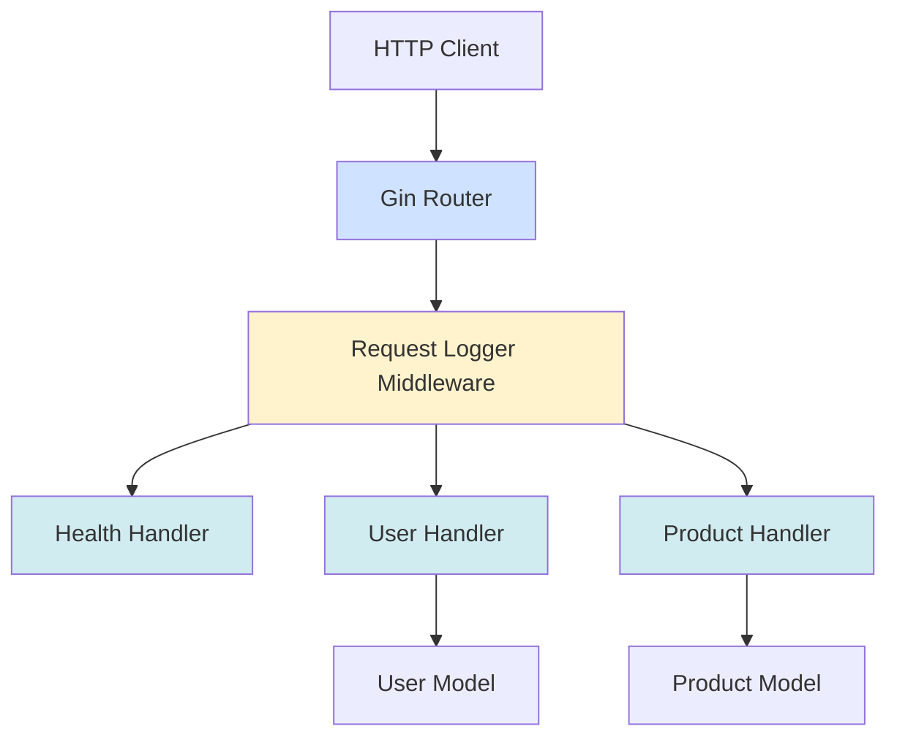
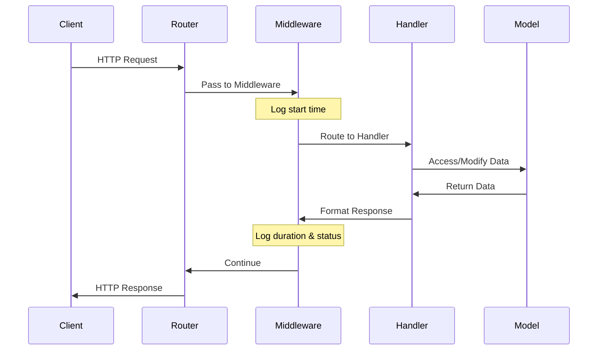

# Architecture Documentation

> **Last Updated:** 2025-11-06
>
> This document describes the system architecture of the doc-agent-demo Go API.

## Overview

The application follows a standard Go API structure with handlers, models, and a main entry point.

## System Architecture



## Project Structure

```
doc-agent-demo/
├── cmd/
│   └── api/
│       └── main.go          # Application entry point
├── internal/
│   ├── handlers/            # HTTP request handlers
│   │   ├── health.go        # Health check endpoint
│   │   ├── user.go          # User CRUD operations
│   │   └── product.go       # Product CRUD operations
│   └── models/              # Data models
│       └── user.go          # User struct definition
├── docs/                    # API documentation (auto-generated)
├── go.mod                   # Go module definition
└── go.sum                   # Go dependencies
```

## Components

### Main Application (`cmd/api/main.go`)

The entry point of the application:
- Initializes the Gin router
- Registers middleware (request logger)
- Registers all API routes
- Starts the HTTP server on port 8080

See [main.go documentation](./main.md) for detailed implementation.

### Middleware

The application uses Gin middleware for cross-cutting concerns:

#### Request Logger Middleware

**Location:** `cmd/api/main.go`

Logs all incoming HTTP requests with timing and status information.

**Features:**
- Logs HTTP method and path
- Records response status code
- Measures request duration
- Executes on every API request

**Implementation:**
```go
func RequestLoggerMiddleware() gin.HandlerFunc {
    return func(c *gin.Context) {
        start := time.Now()
        path := c.Request.URL.Path
        method := c.Request.Method

        // Process request
        c.Next()

        // Log after request
        duration := time.Since(start)
        status := c.Writer.Status()
        log.Printf("[%s] %s - Status: %d - Duration: %v", method, path, status, duration)
    }
}
```

**Example Log Output:**
```
[GET] /api/v1/users - Status: 200 - Duration: 2.5ms
[POST] /api/v1/users - Status: 201 - Duration: 5.1ms
[GET] /api/v1/users/usr_123/profile - Status: 200 - Duration: 1.8ms
[DELETE] /api/v1/users/usr_456 - Status: 200 - Duration: 3.2ms
```

**Use Cases:**
- Performance monitoring and debugging
- Audit logging for compliance
- Request tracing and troubleshooting
- API usage analytics
- Identifying slow endpoints

### Handlers (`internal/handlers/`)

HTTP request handlers that implement the API endpoints:

- **health.go**: Health check endpoint
- **user.go**: User management (CRUD operations + profile endpoint)
- **product.go**: Product management (CRUD operations)

### Models (`internal/models/`)

Data structures used throughout the application:

- **User**: Represents a user entity with ID, name, email, role, phone number, avatar, and timestamps
- **Product**: Represents a product entity with ID, name, and price

See [Data Models Documentation](./DATA_MODELS.md) for complete field descriptions and examples.

## Request Flow



1. Client sends HTTP request
2. Gin router receives the request
3. Request passes through middleware (logging, timing)
4. Appropriate handler processes the request
5. Handler interacts with models if needed
6. Response is formatted and returned
7. Middleware logs the request details (method, path, status, duration)
8. Response sent back to client

## Technology Stack

- **Web Framework**: Gin (github.com/gin-gonic/gin)
- **Language**: Go 1.23+
- **HTTP Server**: Built-in Go net/http
- **Router**: Gin router with middleware support

## API Versioning

The API uses path-based versioning:
- Current version: `/api/v1/`
- Future versions can be added as `/api/v2/`, etc.

---

> **Note:** This documentation is maintained by the automated documentation bot.
> When architectural changes are made, the bot updates this file to reflect the new structure.
