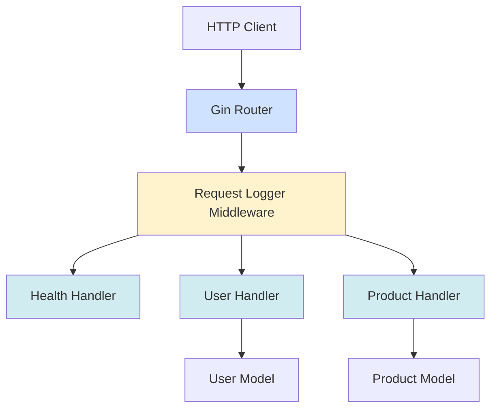
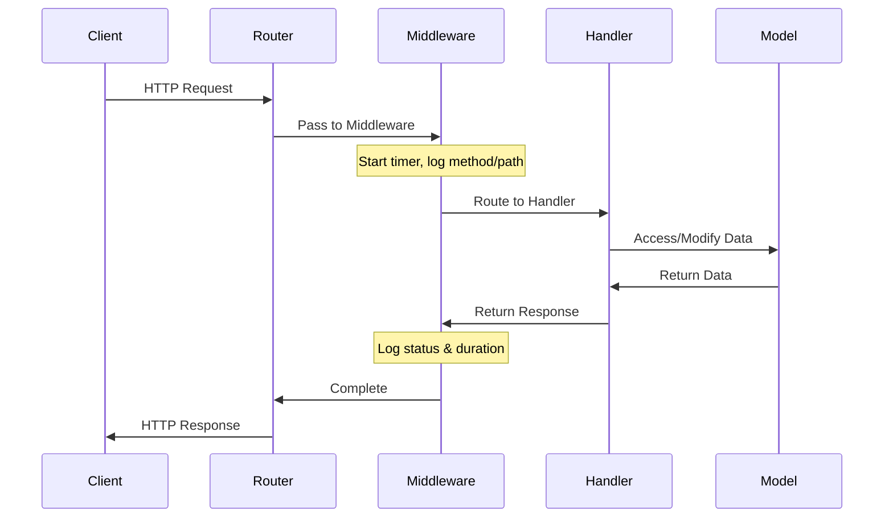
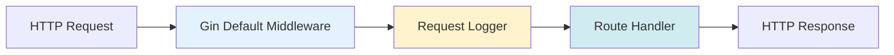

# Architecture Documentation

> **Last Updated:** 2025-11-06
>
> This document describes the system architecture of the doc-agent-demo Go API.

## Overview

The application follows a standard Go API structure with handlers, models, and a main entry point.

## System Architecture



## Project Structure

```
doc-agent-demo/
├── cmd/
│   └── api/
│       └── main.go          # Application entry point
├── internal/
│   ├── handlers/            # HTTP request handlers
│   │   ├── health.go        # Health check endpoint
│   │   ├── user.go          # User CRUD operations
│   │   └── product.go       # Product CRUD operations
│   └── models/              # Data models
│       └── user.go          # User struct definition
├── docs/                    # API documentation (auto-generated)
├── go.mod                   # Go module definition
└── go.sum                   # Go dependencies
```

## Components

### Main Application (`cmd/api/main.go`)

The entry point of the application:
- Initializes the Gin router with default middleware
- Registers custom middleware (RequestLoggerMiddleware)
- Registers all API routes under `/api/v1` group
- Initializes sample data
- Starts the HTTP server on port 8080

#### RequestLoggerMiddleware

**Purpose:** Logs API requests with timing and status information for monitoring and debugging.

**Location:** `cmd/api/main.go:13`

**Functionality:**
- Captures request start time
- Records HTTP method and path
- Processes the request through the handler chain
- Calculates request duration
- Logs method, path, status code, and duration after completion

**Implementation:**
```go
func RequestLoggerMiddleware() gin.HandlerFunc {
    return func(c *gin.Context) {
        start := time.Now()
        path := c.Request.URL.Path
        method := c.Request.Method

        // Process request
        c.Next()

        // Log after request
        duration := time.Since(start)
        status := c.Writer.Status()
        log.Printf("[%s] %s - Status: %d - Duration: %v", method, path, status, duration)
    }
}
```

**Log Format:**
```
[METHOD] /path - Status: STATUS_CODE - Duration: DURATION
```

**Example Log Output:**
```
[GET] /api/v1/users/usr_001 - Status: 200 - Duration: 2.345ms
[POST] /api/v1/users - Status: 201 - Duration: 5.123ms
[GET] /api/v1/users/usr_999/profile - Status: 404 - Duration: 1.234ms
```

**Benefits:**
- Performance monitoring: Track slow endpoints
- Request auditing: Log all API access
- Debugging: Identify failed requests with status codes
- No external dependencies: Uses standard Go logging

### Handlers (`internal/handlers/`)

HTTP request handlers that implement the API endpoints:

- **health.go**: Health check endpoint
- **user.go**: User management (CRUD operations)
- **product.go**: Product management (CRUD operations)

### Models (`internal/models/`)

Data structures used throughout the application:

- **User**: Represents a user entity with ID, name, and email
- **Product**: Represents a product entity with ID, name, and price

## Request Flow



1. Client sends HTTP request
2. Gin router receives the request
3. RequestLoggerMiddleware captures timing information
4. Router matches the route and calls appropriate handler
5. Handler processes the request and interacts with models if needed
6. Response is formatted and returned through the middleware chain
7. Middleware logs the request details (method, path, status, duration)
8. Response is sent back to the client

## Middleware Architecture

The application uses a middleware chain pattern for cross-cutting concerns:



### Middleware Stack

1. **Gin Default Middleware**
   - Logger: Basic request logging
   - Recovery: Panic recovery to prevent server crashes

2. **RequestLoggerMiddleware (Custom)**
   - Request timing and performance monitoring
   - Status code tracking
   - Structured logging for debugging

### Adding New Middleware

To add custom middleware to the application:

```go
// Define middleware function
func MyCustomMiddleware() gin.HandlerFunc {
    return func(c *gin.Context) {
        // Before request
        // ... pre-processing logic ...

        c.Next() // Process request

        // After request
        // ... post-processing logic ...
    }
}

// Register in main.go
func main() {
    r := gin.Default()
    r.Use(RequestLoggerMiddleware())
    r.Use(MyCustomMiddleware()) // Add your middleware
    // ... rest of setup ...
}
```

**Common Middleware Use Cases:**
- Authentication/Authorization
- Rate limiting
- CORS handling
- Request validation
- Response compression
- Error handling

## Technology Stack

- **Web Framework**: Gin (github.com/gin-gonic/gin)
- **Language**: Go 1.23+
- **HTTP Server**: Built-in Go net/http
- **Router**: Gin router with middleware support
- **Logging**: Standard Go log package
- **Concurrency**: sync.RWMutex for thread-safe data access

## API Versioning

The API uses path-based versioning:
- Current version: `/api/v1/`
- Future versions can be added as `/api/v2/`, etc.
- All endpoints are grouped under the version prefix for consistency

---

> **Note:** This documentation is maintained by the automated documentation bot.
> When architectural changes are made, the bot updates this file to reflect the new structure.
