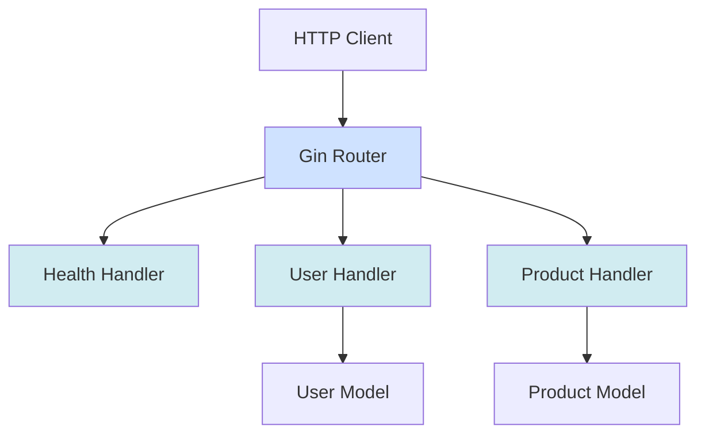
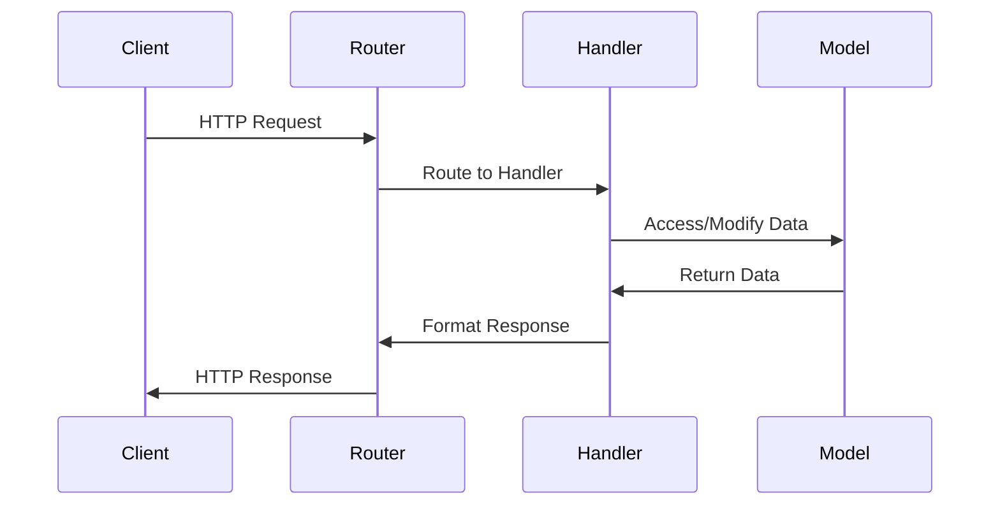

# Architecture Documentation

> **Last Updated:** 2025-11-06
>
> This document describes the system architecture of the doc-agent-demo Go API.

## Overview

The application follows a standard Go API structure with handlers, models, and a main entry point.

## System Architecture



## Project Structure

```
doc-agent-demo/
├── cmd/
│   └── api/
│       └── main.go          # Application entry point
├── internal/
│   ├── handlers/            # HTTP request handlers
│   │   ├── health.go        # Health check endpoints (basic + detailed)
│   │   ├── user.go          # User CRUD operations
│   │   └── product.go       # Product CRUD operations
│   └── models/              # Data models
│       └── user.go          # User struct definition
├── docs/                    # API documentation (auto-generated)
├── go.mod                   # Go module definition
└── go.sum                   # Go dependencies
```

## Components

### Main Application (`cmd/api/main.go`)

The entry point of the application:
- Initializes the Gin router
- Registers all API routes
- Starts the HTTP server on port 8080

### Handlers (`internal/handlers/`)

HTTP request handlers that implement the API endpoints:

- **health.go**: Health check endpoints (`HealthCheck`, `HealthDetails`)
  - `HealthCheck`: Basic health status for load balancers
  - `HealthDetails`: Detailed system information with runtime metrics
- **user.go**: User management (CRUD operations)
- **product.go**: Product management (CRUD operations)

### Models (`internal/models/`)

Data structures used throughout the application:

- **User**: Represents a user entity with ID, name, and email
- **Product**: Represents a product entity with ID, name, and price

## Request Flow



1. Client sends HTTP request
2. Gin router matches the route
3. Appropriate handler processes the request
4. Handler interacts with models if needed
5. Response is formatted and returned

## Technology Stack

- **Web Framework**: Gin (github.com/gin-gonic/gin) v1.9.x
- **Language**: Go 1.23+
- **HTTP Server**: Built-in Go net/http
- **Router**: Gin router with middleware support
- **Runtime Monitoring**: Go runtime package for system metrics

## API Versioning

The API uses path-based versioning:
- Current version: `/api/v1/`
- Future versions can be added as `/api/v2/`, etc.

---

> **Note:** This documentation is maintained by the automated documentation bot.
> When architectural changes are made, the bot updates this file to reflect the new structure.
