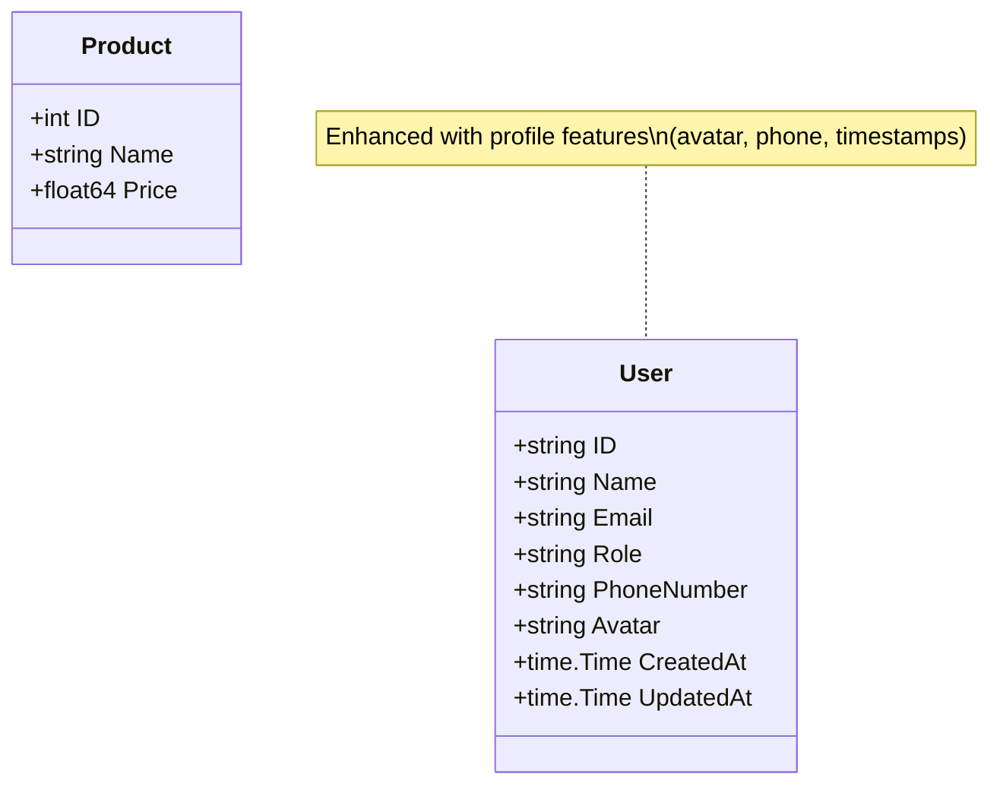

# Data Models Documentation

> **Last Updated:** 2025-11-06
>
> This document describes all data models used in the doc-agent-demo Go API.

## Overview

The application uses Go structs to define data models for users and products.

## User Model

**Location:** `internal/models/user.go`

```go
type User struct {
    ID          string    `json:"id"`
    Name        string    `json:"name"`
    Email       string    `json:"email"`
    Role        string    `json:"role"`
    PhoneNumber string    `json:"phone_number"` // User's phone number
    Avatar      string    `json:"avatar"`       // URL to user's avatar image
    CreatedAt   time.Time `json:"created_at"`
    UpdatedAt   time.Time `json:"updated_at"`
}
```

### Fields

| Field | Type | JSON Tag | Description | Required |
|-------|------|----------|-------------|----------|
| `ID` | `string` | `id` | Unique identifier for the user | Yes (auto-generated) |
| `Name` | `string` | `name` | Full name of the user | Yes |
| `Email` | `string` | `email` | Email address of the user | Yes |
| `Role` | `string` | `role` | User role (e.g., "admin", "user") | Yes |
| `PhoneNumber` | `string` | `phone_number` | User's phone number for contact | No |
| `Avatar` | `string` | `avatar` | URL to user's avatar/profile image | No |
| `CreatedAt` | `time.Time` | `created_at` | Timestamp when user was created | Yes (auto-generated) |
| `UpdatedAt` | `time.Time` | `updated_at` | Timestamp when user was last updated | Yes (auto-set) |

### Validation Rules

- `ID`: Auto-generated string, must be unique
- `Name`: Required, non-empty string
- `Email`: Required, must be valid email format
- `Role`: Required, typically "user" or "admin"
- `PhoneNumber`: Optional, should follow international format (e.g., "+1-555-123-4567")
- `Avatar`: Optional, must be a valid URL if provided
- `CreatedAt`: Auto-generated on creation
- `UpdatedAt`: Auto-updated on modification

### Usage Example

<details>
<summary>Creating a User</summary>

```go
import (
    "time"
    "github.com/yourorg/doc-agent-demo/internal/models"
)

// Basic user
user := models.User{
    ID:        "usr_123456",
    Name:      "John Doe",
    Email:     "john@example.com",
    Role:      "user",
    CreatedAt: time.Now(),
    UpdatedAt: time.Now(),
}

// User with profile information
userWithProfile := models.User{
    ID:          "usr_789012",
    Name:        "Jane Smith",
    Email:       "jane@example.com",
    Role:        "admin",
    PhoneNumber: "+1-555-987-6543",
    Avatar:      "https://example.com/avatars/jane.jpg",
    CreatedAt:   time.Now(),
    UpdatedAt:   time.Now(),
}
```

</details>

### JSON Representation

<details>
<summary>Basic User</summary>

```json
{
  "id": "usr_123456",
  "name": "John Doe",
  "email": "john@example.com",
  "role": "user",
  "phone_number": "",
  "avatar": "",
  "created_at": "2025-11-06T10:30:00Z",
  "updated_at": "2025-11-06T10:30:00Z"
}
```

</details>

<details>
<summary>User with Profile</summary>

```json
{
  "id": "usr_789012",
  "name": "Jane Smith",
  "email": "jane@example.com",
  "role": "admin",
  "phone_number": "+1-555-987-6543",
  "avatar": "https://example.com/avatars/jane.jpg",
  "created_at": "2025-11-06T09:15:00Z",
  "updated_at": "2025-11-06T10:30:00Z"
}
```

</details>

### Profile Features

The User model supports enhanced profile features:

- **Avatar Images**: Store profile pictures via the `Avatar` field (URL to hosted image)
- **Phone Numbers**: Enable phone-based contact or 2FA via the `PhoneNumber` field
- **Roles**: Support role-based access control (RBAC) via the `Role` field
- **Timestamps**: Track account creation and modification via `CreatedAt` and `UpdatedAt`

See [API Documentation](./API.md#get-usersidprofile) for the enhanced profile endpoint that exposes computed profile fields.

---

## Product Model

**Location:** `internal/models/product.go` *(to be implemented)*

```go
type Product struct {
    ID    int     `json:"id"`
    Name  string  `json:"name"`
    Price float64 `json:"price"`
}
```

### Fields

| Field | Type | JSON Tag | Description |
|-------|------|----------|-------------|
| `ID` | `int` | `id` | Unique identifier for the product |
| `Name` | `string` | `name` | Product name |
| `Price` | `float64` | `json` | Product price in USD |

### Validation Rules

- `ID`: Auto-generated, must be positive integer
- `Name`: Required, non-empty string
- `Price`: Required, must be positive number

### Usage Example

```go
product := models.Product{
    ID:    1,
    Name:  "Sample Product",
    Price: 99.99,
}
```

### JSON Representation

```json
{
  "id": 1,
  "name": "Sample Product",
  "price": 99.99
}
```

---

## Model Relationships

Currently, the models are independent with no direct relationships. However, the User model has been enhanced to support richer profile features.



---

> **Note:** This documentation is maintained by the automated documentation bot.
> When models are added, modified, or removed, the bot updates this file accordingly.
