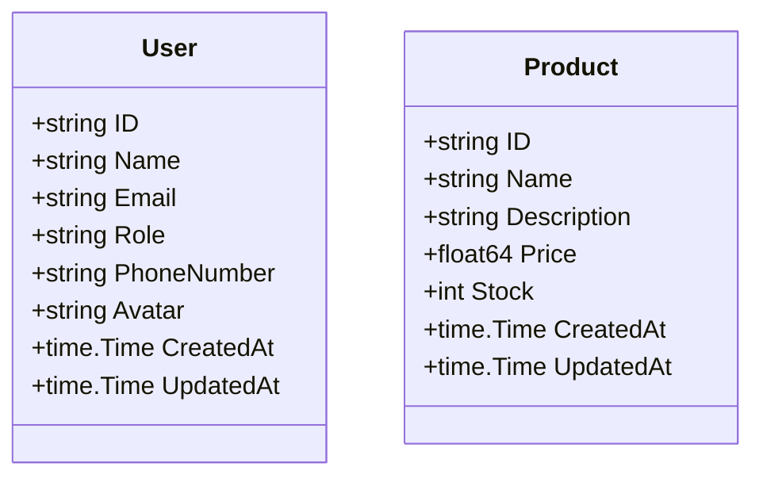

# Data Models Documentation

> **Last Updated:** 2025-11-06
>
> This document describes all data models used in the doc-agent-demo Go API.

## Overview

The application uses Go structs to define data models for users and products.

## User Model

**Location:** `internal/models/user.go`

```go
type User struct {
    ID          string    `json:"id"`
    Name        string    `json:"name"`
    Email       string    `json:"email"`
    Role        string    `json:"role"`
    PhoneNumber string    `json:"phone_number"`
    Avatar      string    `json:"avatar"`
    CreatedAt   time.Time `json:"created_at"`
    UpdatedAt   time.Time `json:"updated_at"`
}
```

### Fields

| Field | Type | JSON Tag | Description |
|-------|------|----------|-------------|
| `ID` | `string` | `id` | Unique identifier for the user (e.g., "usr_001") |
| `Name` | `string` | `name` | Full name of the user |
| `Email` | `string` | `email` | Email address of the user |
| `Role` | `string` | `role` | User's role in the system (e.g., "admin", "user") |
| `PhoneNumber` | `string` | `phone_number` | User's phone number for contact purposes |
| `Avatar` | `string` | `avatar` | URL to the user's avatar/profile picture |
| `CreatedAt` | `time.Time` | `created_at` | Timestamp when the user account was created |
| `UpdatedAt` | `time.Time` | `updated_at` | Timestamp when the user account was last updated |

### Validation Rules

- `ID`: Auto-generated string in format "usr_XXX", must be unique
- `Name`: Required, non-empty string
- `Email`: Required, must be valid email format
- `Role`: Required, typically "admin" or "user"
- `PhoneNumber`: Optional, string format for phone numbers
- `Avatar`: Optional, should be a valid URL to an image
- `CreatedAt`: Auto-generated on user creation
- `UpdatedAt`: Auto-updated on any user modification

### Usage Example

```go
user := models.User{
    ID:          "usr_001",
    Name:        "John Doe",
    Email:       "john@example.com",
    Role:        "user",
    PhoneNumber: "+1-555-0123",
    Avatar:      "https://example.com/avatars/john.jpg",
    CreatedAt:   time.Now(),
    UpdatedAt:   time.Now(),
}
```

### JSON Representation

```json
{
  "id": "usr_001",
  "name": "John Doe",
  "email": "john@example.com",
  "role": "user",
  "phone_number": "+1-555-0123",
  "avatar": "https://example.com/avatars/john.jpg",
  "created_at": "2025-11-06T10:30:00Z",
  "updated_at": "2025-11-06T10:30:00Z"
}
```

### Field Details

<details>
<summary><b>PhoneNumber Field</b></summary>

The `PhoneNumber` field stores the user's contact phone number. It is optional and stored as a string to accommodate various international phone number formats.

**Example formats:**
- `"+1-555-0123"` (US format with country code)
- `"555-0123"` (Local format)
- `"+44 20 7123 4567"` (UK format)

**Usage in API:**
- Can be set during user creation
- Can be updated via PUT /users/:id
- Retrieved in user profile endpoint

</details>

<details>
<summary><b>Avatar Field</b></summary>

The `Avatar` field contains a URL pointing to the user's profile picture or avatar image.

**Specifications:**
- Should be a valid HTTP/HTTPS URL
- Typically points to image hosting services or CDN
- Common formats: JPG, PNG, GIF, WebP
- Recommended size: 256x256 pixels or larger

**Example values:**
```
"https://cdn.example.com/avatars/user123.jpg"
"https://gravatar.com/avatar/abc123"
"https://storage.example.com/profiles/john-doe.png"
```

**API behavior:**
- If not set, the field will be an empty string
- The `/users/:id/profile` endpoint includes `has_avatar` boolean indicating if avatar is set
- No validation is performed on URL format (client responsibility)

</details>

---

## Product Model

**Location:** `internal/models/user.go` (shared file)

```go
type Product struct {
    ID          string    `json:"id"`
    Name        string    `json:"name"`
    Description string    `json:"description"`
    Price       float64   `json:"price"`
    Stock       int       `json:"stock"`
    CreatedAt   time.Time `json:"created_at"`
    UpdatedAt   time.Time `json:"updated_at"`
}
```

### Fields

| Field | Type | JSON Tag | Description |
|-------|------|----------|-------------|
| `ID` | `string` | `id` | Unique identifier for the product (e.g., "prd_001") |
| `Name` | `string` | `name` | Product name |
| `Description` | `string` | `description` | Detailed description of the product |
| `Price` | `float64` | `price` | Product price in USD |
| `Stock` | `int` | `stock` | Available inventory count |
| `CreatedAt` | `time.Time` | `created_at` | Timestamp when the product was created |
| `UpdatedAt` | `time.Time` | `updated_at` | Timestamp when the product was last updated |

### Validation Rules

- `ID`: Auto-generated string in format "prd_XXX", must be unique
- `Name`: Required, non-empty string
- `Description`: Optional, detailed product information
- `Price`: Required, must be positive number (float64 for precision)
- `Stock`: Required, must be non-negative integer
- `CreatedAt`: Auto-generated on product creation
- `UpdatedAt`: Auto-updated on any product modification

### Usage Example

```go
product := models.Product{
    ID:          "prd_001",
    Name:        "High-Performance Laptop",
    Description: "Professional laptop with 16GB RAM and 512GB SSD",
    Price:       999.99,
    Stock:       10,
    CreatedAt:   time.Now(),
    UpdatedAt:   time.Now(),
}
```

### JSON Representation

```json
{
  "id": "prd_001",
  "name": "High-Performance Laptop",
  "description": "Professional laptop with 16GB RAM and 512GB SSD",
  "price": 999.99,
  "stock": 10,
  "created_at": "2025-11-06T10:30:00Z",
  "updated_at": "2025-11-06T10:30:00Z"
}
```

---

## Model Relationships

Currently, the models are independent with no direct relationships.



---

> **Note:** This documentation is maintained by the automated documentation bot.
> When models are added, modified, or removed, the bot updates this file accordingly.
