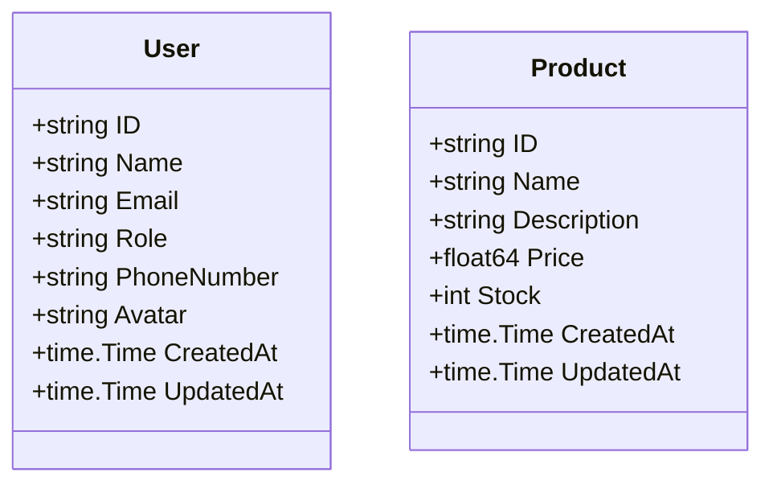

# Data Models Documentation

> **Last Updated:** 2025-11-06
>
> This document describes all data models used in the doc-agent-demo Go API.

## Overview

The application uses Go structs to define data models for users and products.

## User Model

**Location:** `internal/models/user.go`

```go
type User struct {
    ID          string    `json:"id"`
    Name        string    `json:"name"`
    Email       string    `json:"email"`
    Role        string    `json:"role"`
    PhoneNumber string    `json:"phone_number"` // User's phone number
    Avatar      string    `json:"avatar"`       // URL to user's avatar image
    CreatedAt   time.Time `json:"created_at"`
    UpdatedAt   time.Time `json:"updated_at"`
}
```

### Fields

| Field | Type | JSON Tag | Description |
|-------|------|----------|-------------|
| `ID` | `string` | `id` | Unique identifier for the user (e.g., "usr_001") |
| `Name` | `string` | `name` | Full name of the user |
| `Email` | `string` | `email` | Email address of the user |
| `Role` | `string` | `role` | User role (e.g., "admin", "user") |
| `PhoneNumber` | `string` | `phone_number` | User's contact phone number (optional) |
| `Avatar` | `string` | `avatar` | URL to user's profile avatar image (optional) |
| `CreatedAt` | `time.Time` | `created_at` | Timestamp when the user was created |
| `UpdatedAt` | `time.Time` | `updated_at` | Timestamp when the user was last updated |

### Validation Rules

- `ID`: Auto-generated, must be non-empty string with prefix "usr_"
- `Name`: Required, non-empty string
- `Email`: Required, must be valid email format
- `Role`: Optional, defaults to "user" if not specified
- `PhoneNumber`: Optional, should be valid phone number format if provided
- `Avatar`: Optional, should be valid URL if provided
- `CreatedAt`: Auto-generated on creation
- `UpdatedAt`: Auto-updated on any modification

### Usage Example

```go
import "time"

user := models.User{
    ID:          "usr_001",
    Name:        "Alice Johnson",
    Email:       "alice@example.com",
    Role:        "admin",
    PhoneNumber: "+1-555-0123",
    Avatar:      "https://example.com/avatars/alice.jpg",
    CreatedAt:   time.Now(),
    UpdatedAt:   time.Now(),
}
```

### JSON Representation

```json
{
  "id": "usr_001",
  "name": "Alice Johnson",
  "email": "alice@example.com",
  "role": "admin",
  "phone_number": "+1-555-0123",
  "avatar": "https://example.com/avatars/alice.jpg",
  "created_at": "2025-11-05T12:00:00Z",
  "updated_at": "2025-11-05T12:00:00Z"
}
```

---

## Product Model

**Location:** `internal/models/user.go` (same file as User model)

```go
type Product struct {
    ID          string    `json:"id"`
    Name        string    `json:"name"`
    Description string    `json:"description"`
    Price       float64   `json:"price"`
    Stock       int       `json:"stock"`
    CreatedAt   time.Time `json:"created_at"`
    UpdatedAt   time.Time `json:"updated_at"`
}
```

### Fields

| Field | Type | JSON Tag | Description |
|-------|------|----------|-------------|
| `ID` | `string` | `id` | Unique identifier for the product (e.g., "prd_001") |
| `Name` | `string` | `name` | Product name |
| `Description` | `string` | `description` | Detailed product description |
| `Price` | `float64` | `price` | Product price in USD |
| `Stock` | `int` | `stock` | Available inventory quantity |
| `CreatedAt` | `time.Time` | `created_at` | Timestamp when the product was created |
| `UpdatedAt` | `time.Time` | `updated_at` | Timestamp when the product was last updated |

### Validation Rules

- `ID`: Auto-generated, must be non-empty string with prefix "prd_"
- `Name`: Required, non-empty string
- `Description`: Optional, can be empty string
- `Price`: Required, must be positive number
- `Stock`: Required, must be non-negative integer
- `CreatedAt`: Auto-generated on creation
- `UpdatedAt`: Auto-updated on any modification

### Usage Example

```go
import "time"

product := models.Product{
    ID:          "prd_001",
    Name:        "Laptop",
    Description: "High-performance laptop",
    Price:       999.99,
    Stock:       10,
    CreatedAt:   time.Now(),
    UpdatedAt:   time.Now(),
}
```

### JSON Representation

```json
{
  "id": "prd_001",
  "name": "Laptop",
  "description": "High-performance laptop",
  "price": 999.99,
  "stock": 10,
  "created_at": "2025-11-05T12:00:00Z",
  "updated_at": "2025-11-05T12:00:00Z"
}
```

---

## Model Relationships

Currently, the models are independent with no direct relationships.



---

> **Note:** This documentation is maintained by the automated documentation bot.
> When models are added, modified, or removed, the bot updates this file accordingly.
