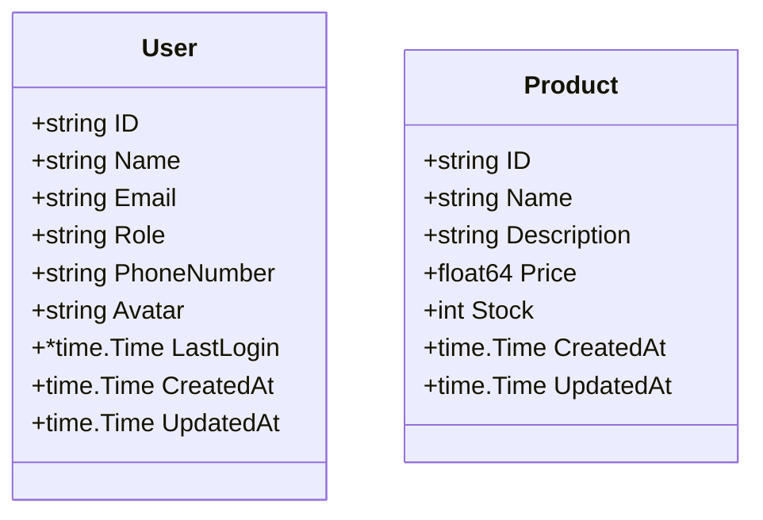

# Data Models Documentation

> **Last Updated:** 2025-11-06
>
> This document describes all data models used in the doc-agent-demo Go API.

## Overview

The application uses Go structs to define data models for users and products.

## User Model

**Location:** `internal/models/user.go`

The User model represents a user entity in the system with authentication and profile information.

```go
type User struct {
    ID          string     `json:"id"`
    Name        string     `json:"name"`
    Email       string     `json:"email"`
    Role        string     `json:"role"`
    PhoneNumber string     `json:"phone_number"`
    Avatar      string     `json:"avatar"`
    LastLogin   *time.Time `json:"last_login"`
    CreatedAt   time.Time  `json:"created_at"`
    UpdatedAt   time.Time  `json:"updated_at"`
}
```

### Fields

| Field | Type | JSON Tag | Required | Description |
|-------|------|----------|----------|-------------|
| `ID` | `string` | `id` | Yes | Unique identifier for the user (e.g., "usr_001") |
| `Name` | `string` | `name` | Yes | Full name of the user |
| `Email` | `string` | `email` | Yes | Email address of the user (must be valid email format) |
| `Role` | `string` | `role` | Yes | User role (e.g., "admin", "user") for access control |
| `PhoneNumber` | `string` | `phone_number` | No | User's contact phone number |
| `Avatar` | `string` | `avatar` | No | URL pointing to the user's avatar image |
| `LastLogin` | `*time.Time` | `last_login` | No | **NEW:** Timestamp of the user's last successful login (nullable) |
| `CreatedAt` | `time.Time` | `created_at` | Yes | Timestamp when the user was created |
| `UpdatedAt` | `time.Time` | `updated_at` | Yes | Timestamp when the user was last modified |

### Field Details

#### LastLogin Field

The `LastLogin` field is a pointer to `time.Time`, which allows it to be `null` in the JSON response when the user has never logged in. This field is automatically updated by the authentication system upon successful login.

**Use Cases:**
- Track user engagement and activity patterns
- Identify inactive users for retention campaigns
- Audit user access for security purposes
- Display "last seen" information in admin dashboards

**Behavior:**
- `null` when a user has never logged in
- Automatically set to current timestamp on successful authentication
- Updated on each successful login event
- Read-only via API (cannot be manually set by clients)

### Validation Rules

- `ID`: Auto-generated string identifier, must be unique (format: "usr_XXX")
- `Name`: Required, non-empty string, 1-255 characters
- `Email`: Required, must be valid email format, unique across all users
- `Role`: Required, must be one of: "admin", "user", "guest"
- `PhoneNumber`: Optional, must be valid phone format when provided
- `Avatar`: Optional, must be valid URL when provided
- `LastLogin`: Optional, nullable timestamp, auto-managed by authentication system
- `CreatedAt`: Auto-generated on user creation
- `UpdatedAt`: Auto-updated on any user modification

### Usage Examples

<details>
<summary>Creating a new user</summary>

```go
import (
    "time"
    "github.com/yourusername/doc-agent-demo/internal/models"
)

// Create a new user (LastLogin is nil initially)
user := &models.User{
    ID:          "usr_003",
    Name:        "Charlie Brown",
    Email:       "charlie@example.com",
    Role:        "user",
    PhoneNumber: "+1-555-0123",
    Avatar:      "https://example.com/avatars/charlie.jpg",
    LastLogin:   nil, // User hasn't logged in yet
    CreatedAt:   time.Now(),
    UpdatedAt:   time.Now(),
}

models.CreateUser(user)
```
</details>

<details>
<summary>Updating LastLogin on authentication</summary>

```go
// After successful login, update the LastLogin timestamp
func handleSuccessfulLogin(userID string) error {
    user, exists := models.GetUserByID(userID)
    if !exists {
        return errors.New("user not found")
    }

    now := time.Now()
    user.LastLogin = &now
    user.UpdatedAt = time.Now()

    return models.UpdateUser(userID, user)
}
```
</details>

<details>
<summary>Querying users by last login</summary>

```go
// Find users who haven't logged in for 30 days
func findInactiveUsers() []*models.User {
    allUsers := models.GetAllUsers()
    inactive := make([]*models.User, 0)
    thirtyDaysAgo := time.Now().Add(-30 * 24 * time.Hour)

    for _, user := range allUsers {
        if user.LastLogin == nil || user.LastLogin.Before(thirtyDaysAgo) {
            inactive = append(inactive, user)
        }
    }

    return inactive
}
```
</details>

### JSON Representation

**User who has logged in:**
```json
{
  "id": "usr_001",
  "name": "Alice Johnson",
  "email": "alice@example.com",
  "role": "admin",
  "phone_number": "+1-555-0100",
  "avatar": "https://example.com/avatars/alice.jpg",
  "last_login": "2025-11-06T14:30:00Z",
  "created_at": "2025-11-05T08:00:00Z",
  "updated_at": "2025-11-06T14:30:00Z"
}
```

**User who has never logged in:**
```json
{
  "id": "usr_002",
  "name": "Bob Smith",
  "email": "bob@example.com",
  "role": "user",
  "phone_number": "",
  "avatar": "",
  "last_login": null,
  "created_at": "2025-11-05T12:00:00Z",
  "updated_at": "2025-11-05T12:00:00Z"
}
```

---

## Product Model

**Location:** `internal/models/user.go`

The Product model represents an item available for purchase in the system.

```go
type Product struct {
    ID          string    `json:"id"`
    Name        string    `json:"name"`
    Description string    `json:"description"`
    Price       float64   `json:"price"`
    Stock       int       `json:"stock"`
    CreatedAt   time.Time `json:"created_at"`
    UpdatedAt   time.Time `json:"updated_at"`
}
```

### Fields

| Field | Type | JSON Tag | Required | Description |
|-------|------|----------|----------|-------------|
| `ID` | `string` | `id` | Yes | Unique identifier for the product (e.g., "prd_001") |
| `Name` | `string` | `name` | Yes | Product name |
| `Description` | `string` | `description` | No | Detailed description of the product |
| `Price` | `float64` | `price` | Yes | Product price in USD (supports up to 2 decimal places) |
| `Stock` | `int` | `stock` | Yes | Available inventory quantity |
| `CreatedAt` | `time.Time` | `created_at` | Yes | Timestamp when the product was created |
| `UpdatedAt` | `time.Time` | `updated_at` | Yes | Timestamp when the product was last modified |

### Validation Rules

- `ID`: Auto-generated string identifier, must be unique (format: "prd_XXX")
- `Name`: Required, non-empty string, 1-255 characters
- `Description`: Optional, max 1000 characters
- `Price`: Required, must be positive number (>= 0.01)
- `Stock`: Required, must be non-negative integer (>= 0)
- `CreatedAt`: Auto-generated on product creation
- `UpdatedAt`: Auto-updated on any product modification

### Usage Example

```go
import (
    "time"
    "github.com/yourusername/doc-agent-demo/internal/models"
)

product := &models.Product{
    ID:          "prd_003",
    Name:        "Wireless Keyboard",
    Description: "Mechanical keyboard with RGB lighting",
    Price:       79.99,
    Stock:       25,
    CreatedAt:   time.Now(),
    UpdatedAt:   time.Now(),
}

models.CreateProduct(product)
```

### JSON Representation

```json
{
  "id": "prd_001",
  "name": "Laptop",
  "description": "High-performance laptop",
  "price": 999.99,
  "stock": 10,
  "created_at": "2025-11-04T08:00:00Z",
  "updated_at": "2025-11-05T14:30:00Z"
}
```

---

## Model Relationships

Currently, the models are independent with no direct relationships.



---

> **Note:** This documentation is maintained by the automated documentation bot.
> When models are added, modified, or removed, the bot updates this file accordingly.
