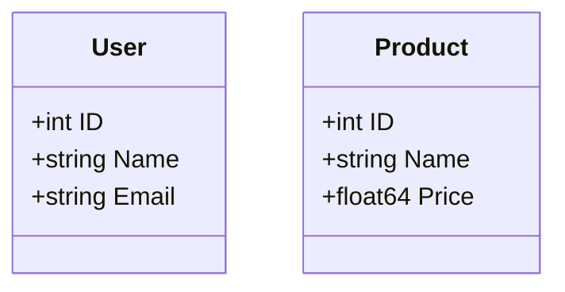

# Data Models Documentation

> **Last Updated:** 2025-11-05
>
> This document describes all data models used in the doc-agent-demo Go API.

## Overview

The application uses Go structs to define data models for users and products.

## User Model

**Location:** `internal/models/user.go`

```go
type User struct {
    ID    int    `json:"id"`
    Name  string `json:"name"`
    Email string `json:"email"`
}
```

### Fields

| Field | Type | JSON Tag | Description |
|-------|------|----------|-------------|
| `ID` | `int` | `id` | Unique identifier for the user |
| `Name` | `string` | `name` | Full name of the user |
| `Email` | `string` | `email` | Email address of the user |

### Validation Rules

- `ID`: Auto-generated, must be positive integer
- `Name`: Required, non-empty string
- `Email`: Required, must be valid email format

### Usage Example

```go
user := models.User{
    ID:    1,
    Name:  "John Doe",
    Email: "john@example.com",
}
```

### JSON Representation

```json
{
  "id": 1,
  "name": "John Doe",
  "email": "john@example.com"
}
```

---

## Product Model

**Location:** `internal/models/product.go` *(to be implemented)*

```go
type Product struct {
    ID    int     `json:"id"`
    Name  string  `json:"name"`
    Price float64 `json:"price"`
}
```

### Fields

| Field | Type | JSON Tag | Description |
|-------|------|----------|-------------|
| `ID` | `int` | `id` | Unique identifier for the product |
| `Name` | `string` | `name` | Product name |
| `Price` | `float64` | `json` | Product price in USD |

### Validation Rules

- `ID`: Auto-generated, must be positive integer
- `Name`: Required, non-empty string
- `Price`: Required, must be positive number

### Usage Example

```go
product := models.Product{
    ID:    1,
    Name:  "Sample Product",
    Price: 99.99,
}
```

### JSON Representation

```json
{
  "id": 1,
  "name": "Sample Product",
  "price": 99.99
}
```

---

## Model Relationships

Currently, the models are independent with no direct relationships.



---

> **Note:** This documentation is maintained by the automated documentation bot.
> When models are added, modified, or removed, the bot updates this file accordingly.
