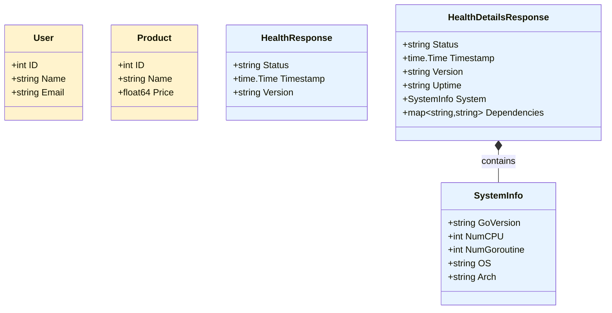

# Data Models Documentation

> **Last Updated:** 2025-11-06
>
> This document describes all data models used in the doc-agent-demo Go API.

## Overview

The application uses Go structs to define data models for users, products, and health monitoring responses.

## User Model

**Location:** `internal/models/user.go`

```go
type User struct {
    ID    int    `json:"id"`
    Name  string `json:"name"`
    Email string `json:"email"`
}
```

### Fields

| Field | Type | JSON Tag | Description |
|-------|------|----------|-------------|
| `ID` | `int` | `id` | Unique identifier for the user |
| `Name` | `string` | `name` | Full name of the user |
| `Email` | `string` | `email` | Email address of the user |

### Validation Rules

- `ID`: Auto-generated, must be positive integer
- `Name`: Required, non-empty string
- `Email`: Required, must be valid email format

### Usage Example

```go
user := models.User{
    ID:    1,
    Name:  "John Doe",
    Email: "john@example.com",
}
```

### JSON Representation

```json
{
  "id": 1,
  "name": "John Doe",
  "email": "john@example.com"
}
```

---

## Product Model

**Location:** `internal/models/product.go` *(to be implemented)*

```go
type Product struct {
    ID    int     `json:"id"`
    Name  string  `json:"name"`
    Price float64 `json:"price"`
}
```

### Fields

| Field | Type | JSON Tag | Description |
|-------|------|----------|-------------|
| `ID` | `int` | `id` | Unique identifier for the product |
| `Name` | `string` | `name` | Product name |
| `Price` | `float64` | `json` | Product price in USD |

### Validation Rules

- `ID`: Auto-generated, must be positive integer
- `Name`: Required, non-empty string
- `Price`: Required, must be positive number

### Usage Example

```go
product := models.Product{
    ID:    1,
    Name:  "Sample Product",
    Price: 99.99,
}
```

### JSON Representation

```json
{
  "id": 1,
  "name": "Sample Product",
  "price": 99.99
}
```

---

## Health Response Models

**Location:** `internal/handlers/health.go`

The health endpoints use specialized response models to provide system health and monitoring information.

### HealthResponse

Basic health check response model for lightweight health checks.

```go
type HealthResponse struct {
    Status    string    `json:"status"`
    Timestamp time.Time `json:"timestamp"`
    Version   string    `json:"version"`
}
```

#### Fields

| Field | Type | JSON Tag | Description |
|-------|------|----------|-------------|
| `Status` | `string` | `status` | Current health status (e.g., "healthy") |
| `Timestamp` | `time.Time` | `timestamp` | Time the health check was performed |
| `Version` | `string` | `version` | API version string |

#### JSON Representation

```json
{
  "status": "healthy",
  "timestamp": "2025-11-05T12:00:00Z",
  "version": "1.0.0"
}
```

---

### HealthDetailsResponse

Comprehensive health response with detailed system metrics and runtime information.

```go
type HealthDetailsResponse struct {
    Status       string            `json:"status"`
    Timestamp    time.Time         `json:"timestamp"`
    Version      string            `json:"version"`
    Uptime       string            `json:"uptime"`
    System       SystemInfo        `json:"system"`
    Dependencies map[string]string `json:"dependencies"`
}
```

#### Fields

| Field | Type | JSON Tag | Description |
|-------|------|----------|-------------|
| `Status` | `string` | `status` | Current health status |
| `Timestamp` | `time.Time` | `timestamp` | Time the health check was performed |
| `Version` | `string` | `version` | API version string |
| `Uptime` | `string` | `uptime` | Duration since application started |
| `System` | `SystemInfo` | `system` | Nested system information object |
| `Dependencies` | `map[string]string` | `dependencies` | Map of dependency names to versions |

#### Usage Example

```go
response := handlers.HealthDetailsResponse{
    Status:    "healthy",
    Timestamp: time.Now(),
    Version:   "1.0.0",
    Uptime:    time.Since(startTime).String(),
    System: handlers.SystemInfo{
        GoVersion:    runtime.Version(),
        NumCPU:       runtime.NumCPU(),
        NumGoroutine: runtime.NumGoroutine(),
        OS:           runtime.GOOS,
        Arch:         runtime.GOARCH,
    },
    Dependencies: map[string]string{
        "gin":     "v1.9.x",
        "runtime": "go" + runtime.Version(),
    },
}
```

#### JSON Representation

```json
{
  "status": "healthy",
  "timestamp": "2025-11-05T12:00:00Z",
  "version": "1.0.0",
  "uptime": "2h15m30.5s",
  "system": {
    "go_version": "go1.23.1",
    "num_cpu": 8,
    "num_goroutine": 15,
    "os": "linux",
    "arch": "amd64"
  },
  "dependencies": {
    "gin": "v1.9.x",
    "runtime": "go1.23.1"
  }
}
```

---

### SystemInfo

Nested structure containing runtime system information.

```go
type SystemInfo struct {
    GoVersion    string `json:"go_version"`
    NumCPU       int    `json:"num_cpu"`
    NumGoroutine int    `json:"num_goroutine"`
    OS           string `json:"os"`
    Arch         string `json:"arch"`
}
```

#### Fields

| Field | Type | JSON Tag | Description |
|-------|------|----------|-------------|
| `GoVersion` | `string` | `go_version` | Go runtime version (from `runtime.Version()`) |
| `NumCPU` | `int` | `num_cpu` | Number of logical CPUs (from `runtime.NumCPU()`) |
| `NumGoroutine` | `int` | `num_goroutine` | Current number of goroutines (from `runtime.NumGoroutine()`) |
| `OS` | `string` | `os` | Operating system name (from `runtime.GOOS`) |
| `Arch` | `string` | `arch` | System architecture (from `runtime.GOARCH`) |

#### Usage Example

```go
sysInfo := handlers.SystemInfo{
    GoVersion:    runtime.Version(),      // "go1.23.1"
    NumCPU:       runtime.NumCPU(),       // 8
    NumGoroutine: runtime.NumGoroutine(), // 15
    OS:           runtime.GOOS,           // "linux"
    Arch:         runtime.GOARCH,         // "amd64"
}
```

#### JSON Representation

```json
{
  "go_version": "go1.23.1",
  "num_cpu": 8,
  "num_goroutine": 15,
  "os": "linux",
  "arch": "amd64"
}
```

#### Typical Values by Platform

| Platform | OS Value | Common Arch Values |
|----------|----------|-------------------|
| Linux | `linux` | `amd64`, `arm64`, `386` |
| macOS | `darwin` | `amd64`, `arm64` |
| Windows | `windows` | `amd64`, `386`, `arm64` |
| FreeBSD | `freebsd` | `amd64`, `arm64` |

---

## Model Relationships

The models have the following relationships:



**Model Categories:**
- **Business Models** (User, Product): Core domain entities
- **Health Models** (HealthResponse, HealthDetailsResponse, SystemInfo): System monitoring and observability

---

> **Note:** This documentation is maintained by the automated documentation bot.
> When models are added, modified, or removed, the bot updates this file accordingly.
