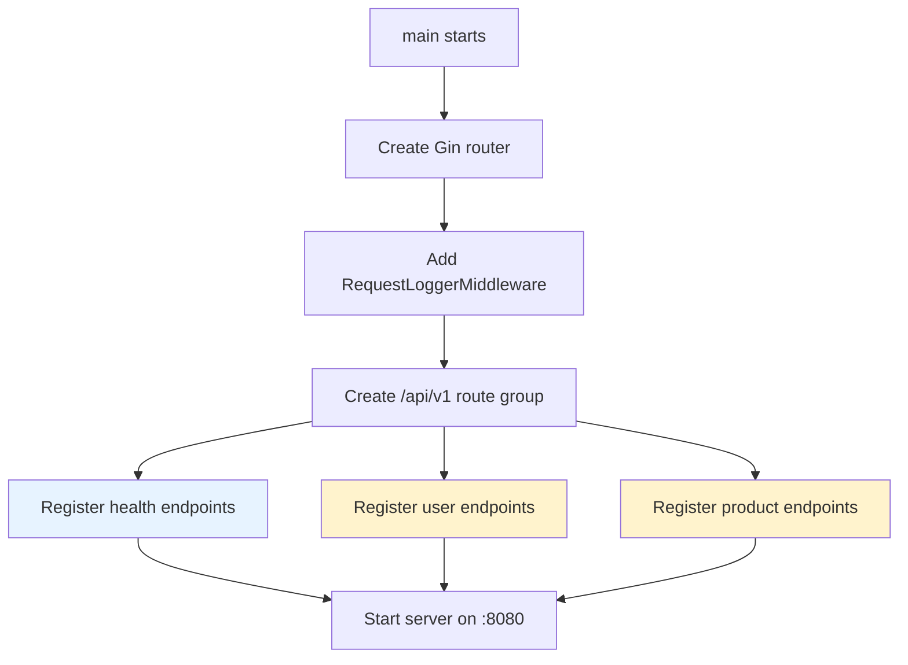

# `main.go` — Entrypoint for the Doc Agent Demo API

Purpose

`main.go` wires the application together and starts the HTTP server. It performs several responsibilities:

- Initialize the Gin router with default middleware
- Add custom request logging middleware for monitoring
- Register all API v1 routes including health checks, user endpoints, and product endpoints
- Initialize sample data for development
- Start the HTTP server on `:8080`

Key behavior

- Uses the Gin web framework for routing and middleware
- Registers health check endpoints:
  - `/api/v1/health` - Basic health check for load balancers
  - `/api/v1/health/details` - Detailed system health with runtime metrics
- Registers CRUD endpoints for users and products under `/api/v1/`
- Uses custom `RequestLoggerMiddleware()` to log all API requests with timing
- Starts the server via `r.Run(":8080")` with error handling

Run / Example

From the project root directory:

```bash
# Run the API server
go run cmd/api/main.go

# Server will be available at http://localhost:8080
```

Example log output on startup:

```
Starting server on :8080
[GIN-debug] [WARNING] Creating an Engine instance with the Logger and Recovery middleware already attached.
[GIN-debug] GET    /api/v1/health            --> github.com/yourorg/doc-agent-demo/internal/handlers.HealthCheck
[GIN-debug] GET    /api/v1/health/details    --> github.com/yourorg/doc-agent-demo/internal/handlers.HealthDetails
[GIN-debug] GET    /api/v1/users             --> github.com/yourorg/doc-agent-demo/internal/handlers.ListUsers
...
```

Testing the health endpoints:

```bash
# Basic health check
curl http://localhost:8080/api/v1/health

# Detailed health with system info
curl http://localhost:8080/api/v1/health/details
```

Success criteria / Exit behavior

- The program logs "Starting server on :8080" and then blocks running the HTTP server
- Each incoming request is logged with method, path, status code, and duration via `RequestLoggerMiddleware`
- If the server fails to start, `log.Fatalf` will print the error and exit with non-zero status

Route Registration Flow



Notes / Next steps

- For local development you can add a simple `Makefile` or a `go run ./...` script
- Consider adding graceful shutdown handling (context cancellation and http.Server) for production-ready behavior
- The `startTime` variable in `internal/handlers/health.go` tracks application uptime from server initialization
