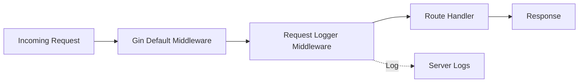

# `main.go` — Entrypoint for the doc-agent-demo API

> **Last Updated:** 2025-11-06

## Purpose

`cmd/api/main.go` is the application entrypoint that wires components together and starts the HTTP server. It performs several key responsibilities:

- Initialize the Gin router with middleware
- Register custom middleware (Request Logger)
- Register all API routes (health, users, products)
- Start the HTTP server on port `:8080`

## Key Components

### Request Logger Middleware

**Added in:** PR #5

Custom middleware function that logs all incoming HTTP requests with timing and status information.

```go
func RequestLoggerMiddleware() gin.HandlerFunc {
    return func(c *gin.Context) {
        start := time.Now()
        path := c.Request.URL.Path
        method := c.Request.Method

        // Process request
        c.Next()

        // Log after request
        duration := time.Since(start)
        status := c.Writer.Status()
        log.Printf("[%s] %s - Status: %d - Duration: %v", method, path, status, duration)
    }
}
```

**Features:**
- Captures request start time before processing
- Logs HTTP method, path, status code, and duration after processing
- Non-blocking - allows request to continue through handler chain
- Applied to all API endpoints via `r.Use(RequestLoggerMiddleware())`

**Example Log Output:**
```
[GET] /api/v1/users - Status: 200 - Duration: 2.5ms
[POST] /api/v1/users - Status: 201 - Duration: 5.1ms
[GET] /api/v1/users/usr_123/profile - Status: 200 - Duration: 1.8ms
```

### Router Configuration

The application uses Gin's router with grouped API versioning:

```go
r := gin.Default()
r.Use(RequestLoggerMiddleware())

v1 := r.Group("/api/v1")
{
    v1.GET("/health", handlers.HealthCheck)

    v1.GET("/users", handlers.ListUsers)
    v1.GET("/users/:id", handlers.GetUser)
    v1.GET("/users/:id/profile", handlers.GetUserProfile)  // Added in PR #5
    v1.POST("/users", handlers.CreateUser)
    v1.PUT("/users/:id", handlers.UpdateUser)
    v1.DELETE("/users/:id", handlers.DeleteUser)

    v1.GET("/products", handlers.ListProducts)
    v1.GET("/products/:id", handlers.GetProduct)
    v1.POST("/products", handlers.CreateProduct)
}
```

### Server Initialization

- Starts HTTP server via `r.Run(":8080")`
- Logs fatal error if server fails to start
- Server blocks on main goroutine (standard for HTTP servers)

## Running the Application

### Development Mode

From the project root directory:

```bash
# Run the API server
go run cmd/api/main.go

# Server will be available at http://localhost:8080
```

### Production Build

```bash
# Build the binary
go build -o bin/api cmd/api/main.go

# Run the binary
./bin/api
```

### Testing the Server

Once the server is running, test the endpoints:

<details>
<summary>Health Check</summary>

```bash
curl http://localhost:8080/api/v1/health
```

Expected response:
```json
{
  "status": "healthy",
  "timestamp": "2025-11-06T10:30:00Z"
}
```

</details>

<details>
<summary>List Users</summary>

```bash
curl http://localhost:8080/api/v1/users
```

</details>

<details>
<summary>Get User Profile</summary>

```bash
curl http://localhost:8080/api/v1/users/usr_123/profile
```

Expected response:
```json
{
  "user": {
    "id": "usr_123",
    "name": "John Doe",
    "email": "john@example.com",
    "role": "user",
    "phone_number": "+1-555-123-4567",
    "avatar": "https://example.com/avatars/john.jpg",
    "created_at": "2025-11-01T08:00:00Z",
    "updated_at": "2025-11-06T10:30:00Z"
  },
  "profile": {
    "has_avatar": true,
    "has_phone_number": true,
    "is_admin": false,
    "account_age_days": 5
  }
}
```

</details>

## Middleware Execution Flow



The Request Logger Middleware executes for every request, logging the following information:
- Before handler: Captures start timestamp
- After handler: Logs method, path, status code, and duration

## Success Criteria

- The program logs Gin startup messages and then blocks running the HTTP server
- Request logger middleware logs each incoming request with timing information
- If the server fails to start, the application exits with a fatal error

## Configuration

The application currently uses hardcoded configuration:
- **Port:** `8080`
- **API Version:** `/api/v1`
- **Log Level:** Standard output via `log.Printf`

## Notes & Improvements

**Current Implementation:**
- Simple logging via `log.Printf` (outputs to stdout)
- All requests are logged (no filtering)
- Middleware executes on every endpoint

**Potential Enhancements:**
- Add structured logging (e.g., `logrus`, `zap`)
- Add configurable log levels (DEBUG, INFO, WARN, ERROR)
- Add request ID tracking for distributed tracing
- Add graceful shutdown handling (context cancellation)
- Environment-based configuration (port, log level)
- Add authentication middleware for protected routes
- Add rate limiting middleware
- Add CORS middleware for frontend integration

## Related Documentation

- [Architecture Overview](./ARCHITECTURE.md) - System architecture and middleware layer
- [API Documentation](./API.md) - Complete API endpoint reference
- [Data Models](./DATA_MODELS.md) - User and Product model definitions
